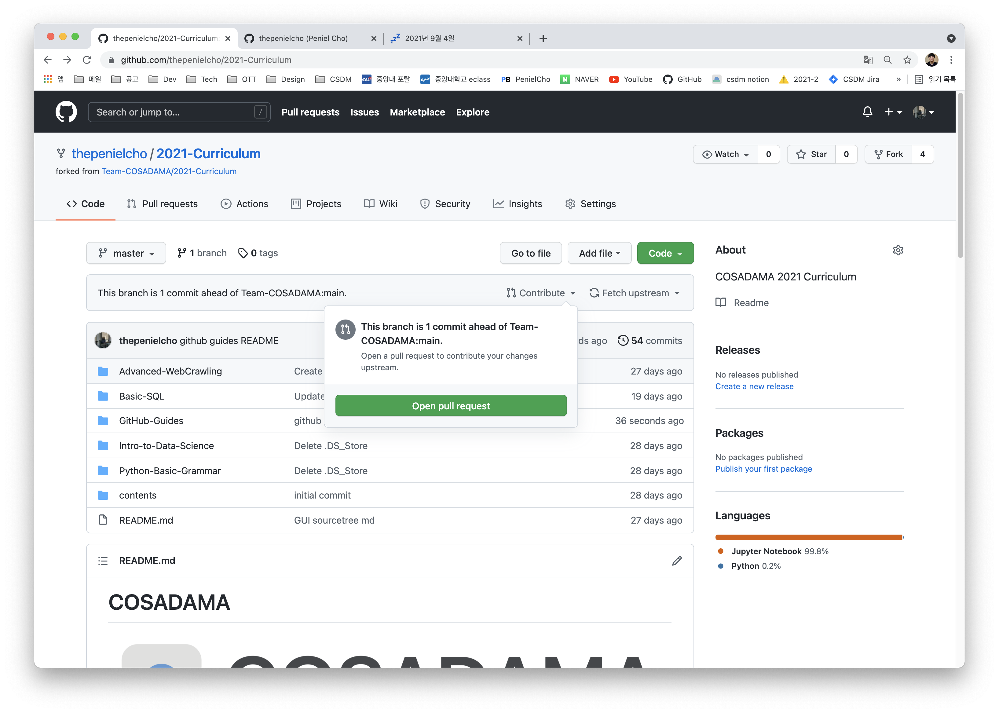
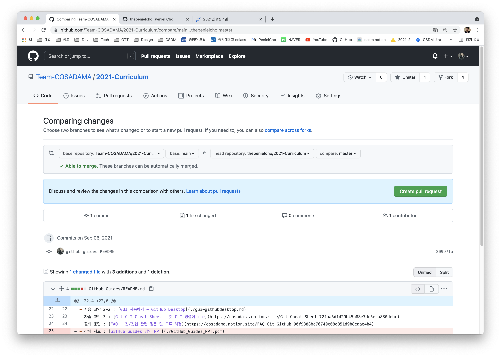

# 발표 자료 업로드하는 방법 (for Members)

애증의 COCO를 성공적으로 마친 여러분들에게 박수를 보냅니다! 👏🏻👏🏻👏🏻 이제 어느 정도 시간도 지났겠다, 프로젝트를 정리하며 회고해볼 시간이에요. 여러분이 COCO를 준비하며 쏟은 열정, 코드, 데이터, 멋진 결과물까지 모든 흔적들을 이곳에 정리하여 업로드 해봅시다. 업로드 방식은 세가지로 나뉩니다. 첫째, 데이터 분석 발표를 한 팀. 대부분의 팀이 포함되죠. 둘째, 프로그래밍 발표를 한 팀. 셋째, 코딩을 직접적으로 다루지 않은 팀. 후기, 팁 등을 주제로 한 발표가 포함됩니다.

- 본 작업은 [Team-COSADAMA](https://github.com/Team-COSADAMA) 계정의 [COCO Repository](https://github.com/Team-COSADAMA/COCO)를 fork한 후, 자신의 로컬 컴퓨터에 clone하여 clone한 working directory에서 이뤄져야 합니다. 일련의 과정이 익숙치 않은 분들은 지난 깃/깃헙 커리큘럼의 [깃헙 기능 살펴보기](https://github.com/Team-COSADAMA/2021-Curriculum/blob/main/GitHub-Guides/github-must-know-features.md) 파트를 참고해주세요. 과정 중 발생하는 에러는 슬랙 채널을 통해 질문해주세요.

- 혹시 마크다운 사용법이 기억나지 않으시는 분들은 지난 깃/깃헙 커리큘럼 사전 과제 [마크다운 공부하기 등](https://cosadama.notion.site/b1f2d31abeae47e1ae3f49b28abfa897)을 참고해주세요.

- 커리큘럼 파트를 살펴봐도 감이 잘 안 온다! 하시는 분들은 깃/깃헙 커리큘럼 [실시간 강의 동영상 녹화본](https://www.youtube.com/watch?v=VqGNIvVah90&t=1187s)의 히나타 파트(26분 20초~)를 참고하세요. 본 업로드 과정과 fork, clone ~ pull request까지의 과정이 유사합니다.

## 데이터 분석 발표를 한 팀
1. 먼저 해당 연도 COCO 폴더(COCO-2020, COCO-2021, etc)에 본인 팀의 폴더를 만들어주세요. 작명은 주제에 관련만 있다면 크게 상관 없습니다. 띄어쓰기는 하이픈(-)으로 대체합니다.
2. 폴더를 만들었다면, 내부 구조는 code, data, result로 통일합니다. 해당 이름의 폴더들을 생성해주세요.
3. 각각의 폴더에 가지고 있는 자료들을 넣어주세요. code와 data의 경우 최대한 많은 자료를 넣어주실 수록 좋습니다.
4. result의 경우 ppt 파일(.ppt, .pptx) 하나, ppt 파일의 pdf본(.pdf) 하나, 스크립트 파일(.md, .docx) 하나 총 세가지 파일을 업로드 해주세요.
5. 세 폴더에 모든 파일들을 넣어주었다면 전체 폴더(본인 팀 폴더)에 README을 생성해주세요. README에 사용될 이미지가 있다면 미리 전체 폴더에 contents 폴더를 만들어 해당 폴더에 이미지들을 넣어놔주세요.
6. README 파일은 아래 규칙에 따라 작성합니다.
    - 발표 제목(h1)
    - 참여자 명단
    - 발표 내용 요약 (분량 상관 X, 이미지 사용 가능)
    - 사용한 데이터 및 출처
    - 프로젝트 폴더 설명: code에 어떤 코드들이 있는지, data에 어떤 데이터들이 있는지, result에 어떤 파일들이 있는지 설명. 목차 형식을 추천하지만 아니어도 상관 없음.

## 프로그래밍 발표를 한 팀
1. 먼저 해당 연도 COCO 폴더(ex - COCO-2020)에 본인 팀의 폴더를 만들어주세요. 작명은 주제에 관련만 있다면 크게 상관 없습니다. 띄어쓰기는 하이픈(-)으로 대체합니다.
2. 폴더 내부구조는 code, result로 통일합니다. 혹시나 다른 폴더가 필요할 경우 추가로 생성해도 좋습니다. (ex - 그래픽이 너무 많아 따로 폴더가 필요)
3. code에는 자신이 밝히고 싶은 코드만 넣어도, 프로젝트 작업 폴더 내용물 전체를 넣어도 무방합니다. 마찬가지로, 해당 코드들에 대한 설명 파일(.md)이나 주석이 존재해도, 존재하지 않아도 좋습니다. 물론 있으면 더 좋습니다.
4. result의 경우 ppt 파일(.ppt, .pptx) 하나, ppt 파일의 pdf본(.pdf) 하나, 스크립트 파일(.md, .docx) 하나 총 세가지 파일을 업로드 해주세요.
5. 세 폴더에 모든 파일들을 넣어주었다면 전체 폴더(본인 팀 폴더)에 README을 생성해주세요. README에 사용될 이미지가 있다면 미리 전체 폴더에 contents 폴더를 만들어 해당 폴더에 이미지들을 넣어놔주세요.
6. README 파일은 아래 규칙에 따라 작성합니다.
    - 발표 제목(h1)
    - 참여자 명단
    - 발표 내용 요약 (분량 상관 X, 이미지 사용 가능)
    - 사용한 툴 및 레퍼런스 소개
    - 프로젝트 폴더 설명: code에 어떤 코드들이 있는지, result에 어떤 파일들이 있는지 설명. 목차 형식을 추천하지만 아니어도 상관 없음.

## 코딩을 직접적으로 다루지 않은 팀
1. 먼저 해당 연도 COCO 폴더(ex - COCO-2020)에 본인 팀의 폴더를 만들어주세요. 작명은 주제에 관련만 있다면 크게 상관 없습니다. 띄어쓰기는 하이픈(-)으로 대체합니다.
2. 폴더 내부구조는 resources, result로 통일합니다. 혹시나 다른 폴더가 필요할 경우 추가로 생성해도 좋습니다.
3. resources에는 발표를 준비하는 데에 영감을 준 것들, 참고한 것들 등을 넣어주시면 됩니다. 자신이 진행한 코딩 프로젝트가 될 수도, 특정한 도서가 될 수도, 영상이 될 수도 있습니다. 파일로 업로드하기 어려울 경우 마크다운(.md) 파일을 생성하여 글로 레퍼런스를 나타내주시면 좋습니다.
4. result의 경우 ppt 파일(.ppt, .pptx) 하나, ppt 파일의 pdf본(.pdf) 하나, 스크립트 파일(.md, .docx) 하나 총 세가지 파일을 업로드 해주세요.
5. 세 폴더에 모든 파일들을 넣어주었다면 전체 폴더(본인 팀 폴더)에 README을 생성해주세요. README에 사용될 이미지가 있다면 미리 전체 폴더에 contents 폴더를 만들어 해당 폴더에 이미지들을 넣어놔주세요.
6. README 파일은 아래 규칙에 따라 작성합니다.
    - 발표 제목(h1)
    - 참여자 명단
    - 발표 내용 요약 (분량 상관 X, 이미지 사용 가능)
    - 레퍼런스 등 소개
    - 프로젝트 폴더 설명: resources에 어떤 레퍼런스들이 있는지, result에 어떤 파일들이 있는지 설명. 목차 형식을 추천하지만 아니어도 상관 없음.

## PULL REQUEST 열기
README 작성과 각 폴더에 파일을 넣어주셨다면 업로드를 해봅시다.

1. 각 연도별 COCO 폴더(COCO-2020, COCO-2021, etc)안에 자신이 발표한 내용을 담은 폴더를 만들어 README 파일과 code, data, result 폴더 등 위 매뉴얼에 따른 폴더 및 파일들을 넣어주었다면 준비는 완료 되었습니다. 혹시나 위치 오류나 오타는 없는지 다시 한번 확인해주세요.

2. 오류 및 오타가 없다면, 여러분이 fork한 레포지토리에 commit 및 push해주시면 돼요. 아래 순서로 add부터 push까지 완료해주세요.
    ```shell
    git add .
    git commit -m "커밋 내용"
    git push origin main
    ```

3. 이제 pull request를 열어봅시다. push가 성공적으로 완료되었다면, 자신의 fork된 레포지토리에 아래와 같은 문구가 보일 거에요.


    this branch is 1 commit ahead of ~ 라는 문구가요. 오리지널 레포지토리에 없던 변화가 생겼으니 당연하겠죠? 우측에 위치한 contribute를 눌러 open pull request 버튼을 클릭해주세요.

4. 그럼 아래와 같은 화면이 뜰 거에요. create pull request를 눌러줍니다.


5. 이제 Open a pull request라는 제목의 화면이 보이는데, 여기서 커밋의 제목을 수정하거나 덧붙이고 싶으신 내용을 leave a comment 부분에 적어주세요. 완료하셨다면, 우측에 위치한 Reviewrs를 클릭해주세요. 그럼 검색창이 나오는데, 여기서 thepenielcho를 검색하여 저(thepenielcho)를 reviewer로 지정해주세요. 여러분의 커밋에 오류는 없는지, 파일 구조는 정확한지, 병합 시 문제될 요소는 없는지 확인 후 문제가 없다면 pull request를 승인할 예정입니다. Reviewer 지정까지 완료하였다면 아래에 있는 Create pull request 버튼을 눌러주세요. 그럼 정말 끝! 혹시나 양식을 지키지 않으셨거나, 파일 구조가 잘못 되었을 경우 제가 풀리퀘를 취소하고 다시 업로드를 요청드릴 수 있습니다.


궁금하신 점은 슬랙 채널을 통해 언제나 편하게 질문 주세요.